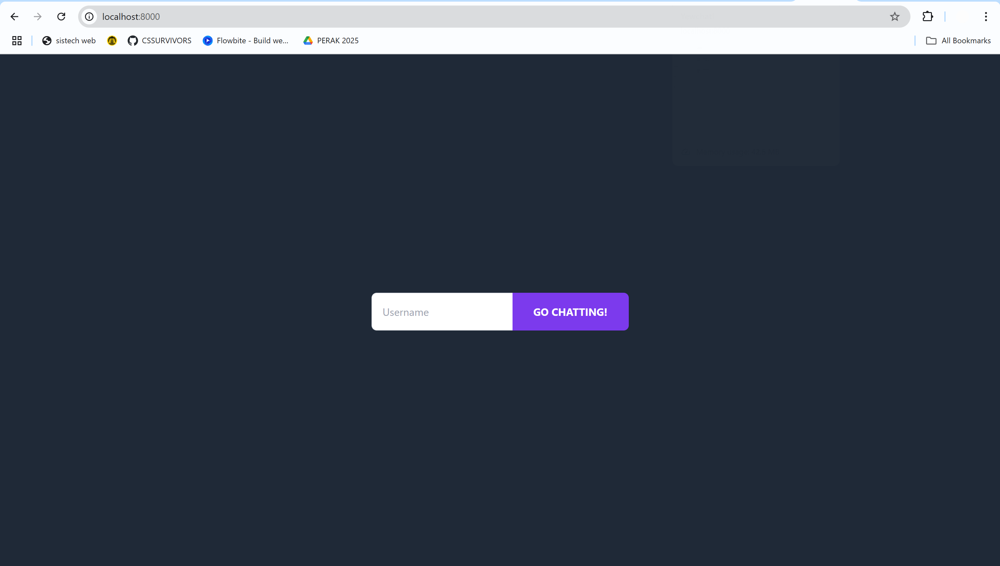
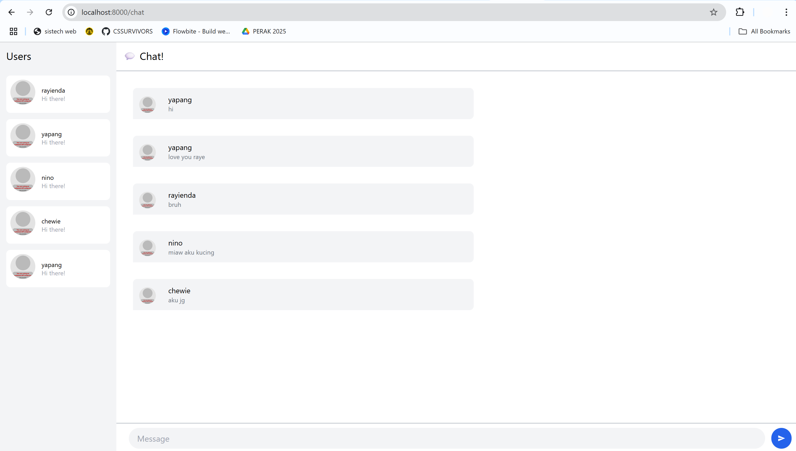
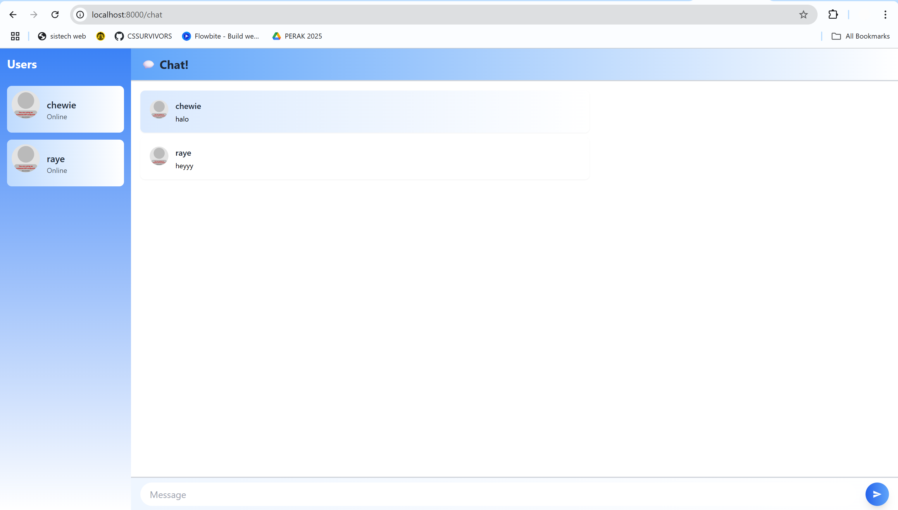

### 3.1 Original Code

### 3.2 Be Creative!

I created a Yew Chat component that registers users and exchanges JSON messages via a WebsocketService with serde for serialization. I swapped the original gray panels for cohesive blue-to-white gradients on the sidebar, header, message bubbles, and input area, and use alternating backgrounds to distinguish each chat entry. User input is captured with a NodeRef, sent as a WebSocketMessage, then cleared all wrapped in rounded, avatar-driven cards for a better look.